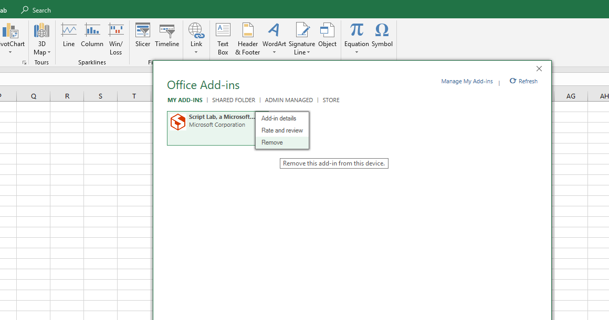
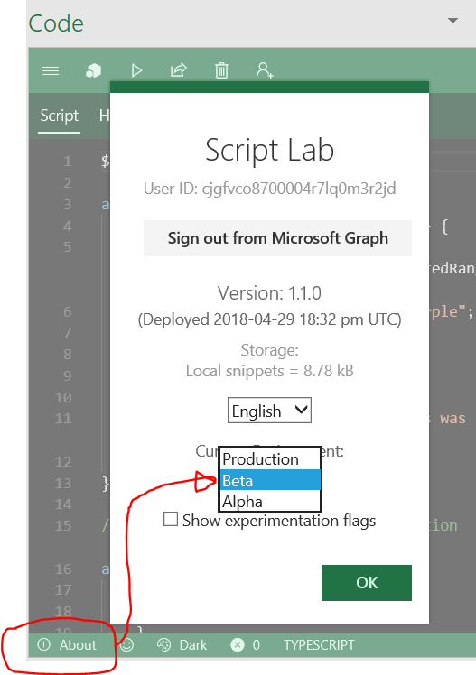

# Custom Functions Dogfood

## Setup

### Prereq:  Ensure you have the "DevMain Channel (Dogfood)"

Be sure that your Office installation is on "DevMain Channel (Dogfood)":


### Step 1: Remove the existing Store version of Script Lab
If you already have Script Lab in your ribbon, please uninstall the Store version, so that you can sideload a custom-function-compatible version.


### Step 2: Sideload Manifest
The new manifest to sideload can be found [here](https://raw.githubusercontent.com/OfficeDev/script-lab/master/manifests/script-lab-prod.xml).

If you've not sideloaded before via a network share, please refer to the [official documentation](https://docs.microsoft.com/en-us/office/dev/add-ins/testing/create-a-network-shared-folder-catalog-for-task-pane-and-content-add-ins).


### Step 3: Switch to Alpha
For now, the Custom Functions experience is only available in the **Beta** deployment of Script lab.  So, in addition to sideloading the manifest (which is orthogonal to this step), you also need to switch to Beta (**Code editor ==> About ==> Environment: Beta**)




## A picture is worth a thousand recalcs


Custom Functions in action. Note the console.logs in the dashboard, as well!


## Usage

Open the `Code` and `Functions` taskpanes, via the Ribbon.

In the code editor, create a new snippet, and replace the existing code with the following:

```typescript
/** @CustomFunction */
function sum(a: number, b: number): number {
    return a + b;
}
```

If you want, you can also specify the function description and parameter descriptions in the JSDOC.  **BUT**, no matter what, you must include the **`@CustomFunction`** somewhere in the JSDOC (i.e., inside of a `/** ... */` block -- the double-star is important!)

```typescript
/**
* Adds two numbers
* @param a - First number to add
* @param b - Second number to add
* @CustomFunction
*/
function sum(a: number, b: number): number {
    return a + b;
}
```

To try a web-service Custom Function, [import](http://aka.ms/scriptlab/import) this GitHub Gist: <https://gist.github.com/c8bbf1dd5c7fb33d5ea262e83e7df399>. Be sure to click "Trust" after importing.


## Friendly advice:

1. Remember to add `/** @CustomFunction */` to any function you want registered.

1. If you want to use `console.log`, do!  It will show up in the Custom Functions dashboard taskpane.

1. **DO NOT CLOSE ANY OF THE PANES AFTER OPENING.**
There is currently a bug that will cause the custom functions runner to die if any of the panes are closed.

1. If you close and and re-open Excel, remember to re-register your custom functions.


## Troubleshooting
If for any reason your functions turn into `#GETTING_DATA` indefinitely, restart Excel.

## Known issues

### Platform

1. If you close any Script Lab taskpane, the custom function runner may die and you'll need to restart Excel
2. If you enter a Custom Function into a formula and then remove the function -- or if you restart Excel and before you re-register the custom functions -- the formula bar will show something like `=_xldudf_96323233322223(...)`

### Script Lab
At the moment, the experience should be functional but not polished.  We will be working with a designer to polish it soon.


